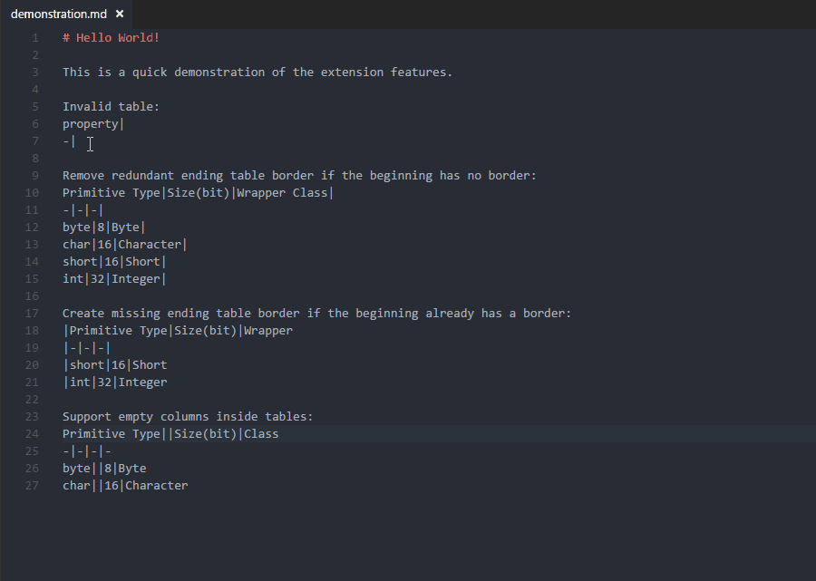

# Markdown table prettifier

[](https://github.com/darkriszty/MarkdownTablePrettify-VSCodeExt/actions)
[](https://marketplace.visualstudio.com/items?itemName=darkriszty.markdown-table-prettify)
[](https://hub.docker.com/r/darkriszty/prettify-md/tags?page=1&ordering=last_updated)
[](https://www.npmjs.com/package/markdown-table-prettify)

Makes tables more readable for humans. Compatible with the Markdown writer plugin's table formatter feature in Atom.

## Feature highlights

- Remove redundant ending table border if the beginning has no border, so the table _will not end_ with "|".
- Create missing ending table border if the beginning already has a border, so the table _will end_ with "|".
- Save space by not right-padding the last column if the table has no border.
- Support empty columns inside tables.
- Support column alignment options with ":".
- Find and format multiple tables.
- Support \``code blocks`\` and ignore blocks with `<!-- markdown-table-prettify-ignore-start -->` and `<!-- markdown-table-prettify-ignore-end -->`.
- Support indented tables.

## Visual Studio Code



The extension is available for markdown language mode. It can either prettify a selection (`Format Selection`) or the entire document (`Format Document`).
A VSCode command called `Prettify markdown tables` is also available to format the currently opened document. 

### Configurable settings:
- The maximum texth length of a selection/entire document to consider for formatting. Default: 1M chars (limit does not apply from CLI or NPM).
- Additional languages to support formatting for besides `markdown`. See possible configurable values [here](https://code.visualstudio.com/docs/languages/identifiers#_known-language-identifiers). Default: `[ ]`.
- Keyboard shortcut to prettify the currently opened markdown document. Default: CTRL+ALT+M (CMD+ALT+M on Mac).

## NPM

The core formatting logic is available as an NPM package: `npm install --save markdown-table-prettify`. The Typescript code is compiled down to ES5 and shipped inside the package.

It currently exposes the entry point also used by the _CLI_. It can be used from regular NodeJS or web apps:

```JS
import { CliPrettify } from 'markdown-table-prettify';
// or
const { CliPrettify } = require('markdown-table-prettify');

console.log(CliPrettify.prettify(
`hello|world
-|-
foo|bar`));

/* Output:
hello | world
------|------
foo   | bar
*/
```

## Docker

The core formatting logic is available as a node docker image: `docker pull darkriszty/prettify-md`.

Available features from docker:
- To prettify a file: `docker container run -i darkriszty/prettify-md < input.md`.
- To prettify a file and save the output: `docker container run -i darkriszty/prettify-md < input.md > output.md`.
- To check whether a file is prettyfied or not: `docker container run -i darkriszty/prettify-md --check < input.md`. This will fail with an exception and return code `1` if the file is not prettyfied.

## CLI

Formatting files or checking if they're already formatted is possible from the command line. This requires `node` and `npm` (optionally also `npx`).

### Available features from the command line:
- To prettify a file: `npm run --silent prettify-md < input.md`.
- To prettify a file and save the output: `npm run --silent prettify-md < input.md > output.md`.
- To check whether a file is prettyfied or not: `npm run --silent check-md < input.md`. This will fail with an exception and return code `1` if the file is not prettyfied.

> Note: the `--silent` switch sets the NPM log level to silent, which is useful to hide the executed file name and concentrate on the actual output.

### Installation

To access the CLI, the extension can either be used from the Github sources, from the already instaledl VSCode extension or from NPM.

#### Compiling from the source code

- Download the source code.
- Go to the extension directory.
- Run `npm install`.
- Run `npm run compile`.

#### Using the already installed VSCode extension

Locate the installed extension path. The typical location of the installed extension:
- Windows: `%USERPROFILE%\.vscode\extensions\darkriszty.markdown-table-prettify-{version}`
- macOS: `~/.vscode/extensions/darkriszty.markdown-table-prettify-{version}`
- Linux: `~/.vscode/extensions/darkriszty.markdown-table-prettify-{version}`

#### Getting it from NPM

Install the NPM package `npm install -g markdown-table-prettify`. Optionally, use `npx` to prettify files: `npx markdown-table-prettify < input.md` (instead of `npm run --silent prettify-md < input.md`).

## Known Issues

- Tables with mixed character widths (eg: CJK) are not always properly formatted (issue #4).